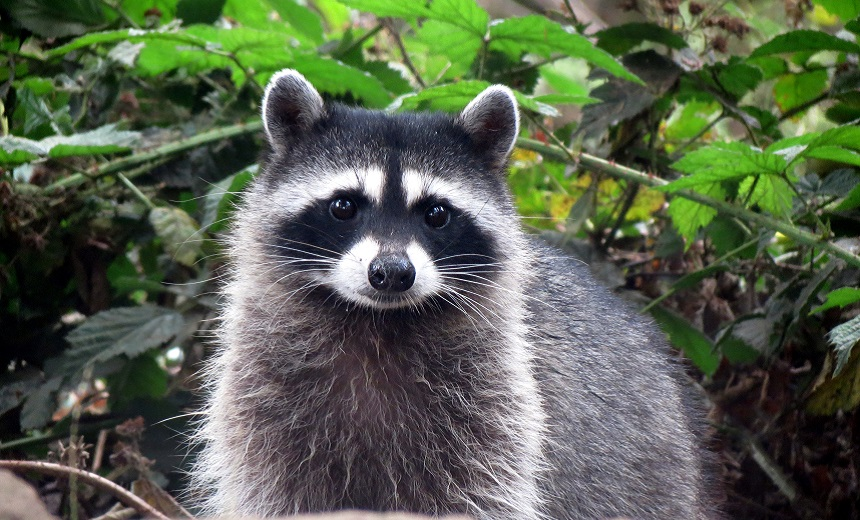
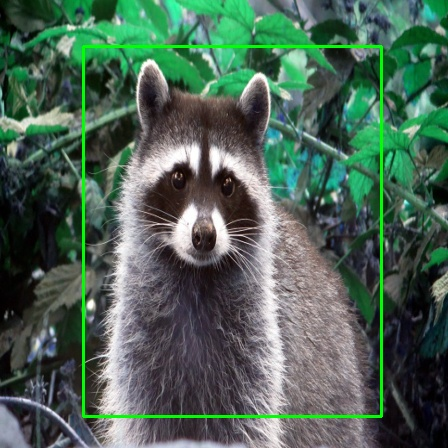

# YOLO V1
- One Stage Object Detector.
- Pytorch Implementation from scratch on custom dataset of Raccons.
- Implementation of Paper [You Only Look Once: Unified, Real-Time Object Detection]( https://arxiv.org/abs/1506.02640)

## Implementation Details 
1. Create pytorch Dataloader that generates grid on image with given grid dimension and maps bounding boxe centers to the grid cells. 
2. Implementation of custom loss function stated in research paper.
3. Define CNN model architechture stated in paper and add fully connected layers according to the the given perameters like grid size and number of classes.
4. Traine model with creataed dataloader.
5. For the inference purpose, Note that model gives predicted bounding boxes with respect to perticualr grid cell.That need to be converted with respect to the whole image to get proper bounding boxes.
6. Apply Non-Max-Suppression on the predicted boxes to get single proper bounding box.

## Datasets
- Used Racoon Detection Dataset available on Kaggle.
- [Racoon Detection](https://www.kaggle.com/debasisdotcom/racoon-detection)

## Inference
```  
$ python3 infer.py -i <path_to_image> -m <path_to_model>
```
&nbsp;&nbsp;&nbsp;&nbsp; Results are stored in Output Folder


## Results
 


## Pretrained Model 
- Pytorch implementation Yolo V1 Model 
- Model Trained with 150 epochs.
- Download Link : [Model](https://drive.google.com/file/d/1y7HOpj6miQto-hfIQmezokBgI_aw1-qg/view?usp=sharing)

## Future Work / Improvements 
- Support of Multi Class Detection 
- Implementaiton of Higher version of YOLO
